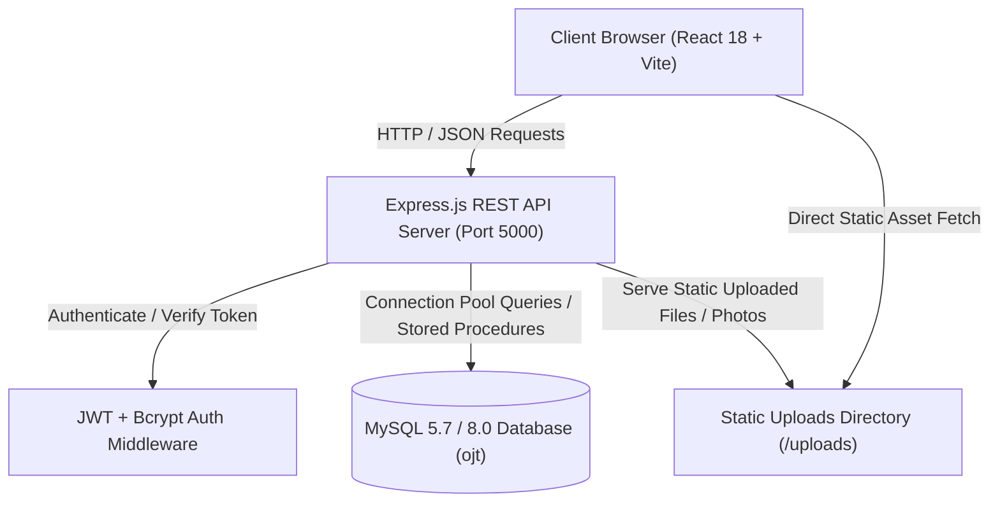
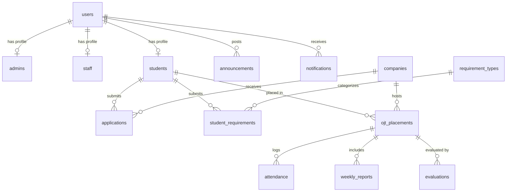
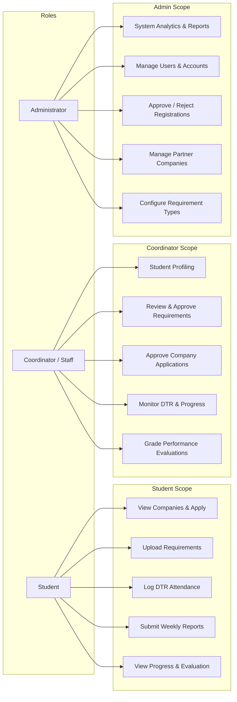
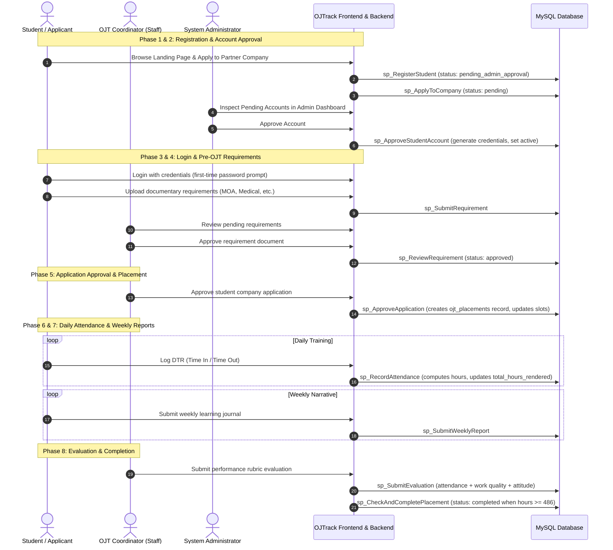
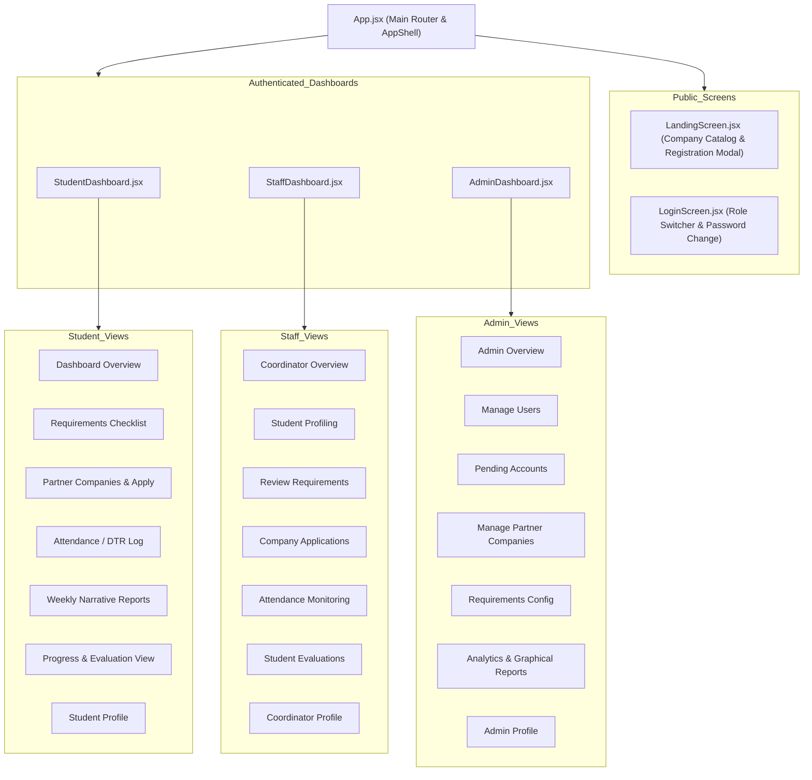

# 🎓 On-the-Job Training (OJT) Management System — Comprehensive Process & Architecture Documentation

> **OJTrack**: An end-to-end On-the-Job Training Management & Student Placement Information System for Universities and Host Training Establishments (HTEs).

---

## 📑 Table of Contents
1. [Executive Summary & System Overview](#1-executive-summary--system-overview)
2. [Technology Stack & System Architecture](#2-technology-stack--system-architecture)
3. [Database Architecture & Data Dictionary](#3-database-architecture--data-dictionary)
4. [User Roles & Access Control (RBAC)](#4-user-roles--access-control-rbac)
5. [End-to-End Core Business Processes & Lifecycle Workflows](#5-end-to-end-core-business-processes--lifecycle-workflows)
   - [Phase 1: Student Registration & Public Company Application](#phase-1-student-registration--public-company-application)
   - [Phase 2: Account Approval & Credential Provisioning](#phase-2-account-approval--credential-provisioning)
   - [Phase 3: Authentication & Security Flow](#phase-3-authentication--security-flow)
   - [Phase 4: Pre-OJT Requirements Submission & Review](#phase-4-pre-ojt-requirements-submission--review)
   - [Phase 5: Company Application Approval & OJT Placement](#phase-5-company-application-approval--ojt-placement)
   - [Phase 6: Daily Time Record (DTR) & Attendance Tracking](#phase-6-daily-time-record-dtr--attendance-tracking)
   - [Phase 7: Weekly Narrative Report Submission](#phase-7-weekly-narrative-report-submission)
   - [Phase 8: Student Performance Evaluation & OJT Completion](#phase-8-student-performance-evaluation--ojt-completion)
   - [Phase 9: Administrative Management, Company Directory & Analytics](#phase-9-administrative-management-company-directory--analytics)
6. [API & Route Specifications](#6-api--route-specifications)
7. [Frontend Architecture & Screen Hierarchy](#7-frontend-architecture--screen-hierarchy)
8. [Database Stored Procedures Catalog](#8-database-stored-procedures-catalog)

---

## 1. Executive Summary & System Overview

The **On-the-Job Training (OJT) Management System (OJTrack)** automates and streamlines the entire internship lifecycle for educational institutions (such as Bohol Island State University - BISU). It bridges communication between **Students / Trainees**, **OJT Coordinators / Staff**, **Partner Companies (Host Training Establishments - HTEs)**, and **System Administrators**.

### Key System Capabilities:
- **Centralized Partner Company Directory**: Publicly viewable and searchable catalogue of verified companies with available slots and documentary requirements.
- **Automated Student Registration & Application**: Self-registration by students directly linked to company applications.
- **Administrative Account Vetting**: Verification workflow preventing unauthorized access before account activation.
- **Requirement Verification Matrix**: Digital submission and approval of required documents (MOA, Medical Certificate, Parent Consent, Endorsement Letters, etc.).
- **Live Daily Time Record (DTR) Logging**: Automated computation of rendered training hours towards the required quota (default: 486 hours).
- **Weekly Narrative Reports**: Submission and tracking of student weekly learning journals.
- **Performance Evaluation Rubric**: Comprehensive evaluation system scoring attendance, work quality, attitude, and total competence.
- **Statistical Dashboard & Analytical Charts**: Real-time KPI summaries and monthly graphical trends (registrations, placements, hours tracked).

---

## 2. Technology Stack & System Architecture

### Frontend Stack:
- **Framework**: React 18 with Vite.
- **Styling**: Vanilla CSS with modern Glassmorphism, CSS Custom Properties, and responsive flex/grid layouts.
- **State Management & Context**: React Context API (`AuthContext.jsx`) with persistent `localStorage` authentication tokens.
- **Animation & Transitions**: `framer-motion` for fluid page and modal animations.
- **Data Visualization**: `recharts` for monthly statistical bar and line graphs.
- **Icons & Alerts**: `lucide-react` icons and `react-hot-toast` notifications.

### Backend Stack:
- **Runtime & Framework**: Node.js with Express.js.
- **Authentication & Security**: JSON Web Tokens (`jsonwebtoken`), `bcrypt` password hashing, and role-based route middleware (`verifyToken`, `isStudent`, `isStaff`, `isAdmin`, `isAdminOrStaff`).
- **Database Connector**: `mysql2/promise` connection pooling with Stored Procedure executions.
- **File Uploads**: `multer` handling company photos and documentary submissions.
- **Diagnostics**: Real-time server diagnostics (uptime, RAM/heap usage, CPU cores, DB latency ping).

---

## 3. Database Architecture & Data Dictionary

The system database (`ojt`) contains **14 core tables** structured with foreign key constraints, cascade deletions, and relational integrity.

### Table Breakdown:

| Table Name | Description | Key Attributes |
| :--- | :--- | :--- |
| `users` | Master authentication table | `user_id`, `email`, `password_hash`, `plain_password`, `role`, `status`, `requires_password_change` |
| `students` | Student demographic & academic profiles | `student_id`, `user_id`, `student_number`, `full_name`, `course`, `year_level`, `gender`, `required_hours` (486) |
| `staff` | Coordinator / Faculty supervisor profiles | `staff_id`, `user_id`, `employee_id`, `full_name`, `department`, `contact_number` |
| `admins` | System administrators profile data | `admin_id`, `user_id`, `full_name` |
| `companies` | Host Training Establishments (HTEs) directory | `company_id`, `company_name`, `industry`, `address`, `contact_person`, `slots_available`, `photo_url`, `status` |
| `applications` | Student internship applications to companies | `application_id`, `student_id`, `company_id`, `status` (`pending`, `accepted`, `rejected`), `applied_at`, `approved_by` |
| `ojt_placements` | Active student training placements | `placement_id`, `student_id`, `company_id`, `start_date`, `end_date`, `required_hours`, `total_hours_rendered`, `status` |
| `attendance` | Daily Time Records (DTR) | `attendance_id`, `placement_id`, `log_date`, `time_in`, `time_out`, `hours_rendered`, `status`, `remarks` |
| `requirement_types` | Master list of documentary requirements | `requirement_id`, `name`, `description`, `is_required`, `deadline` |
| `student_requirements` | Student requirement file uploads & status | `submission_id`, `student_id`, `requirement_id`, `file_path`, `status` (`pending`, `approved`, `rejected`), `remarks`, `reviewed_by` |
| `weekly_reports` | Weekly narrative learning journals | `report_id`, `placement_id`, `week_number`, `narrative`, `status` (`submitted`, `reviewed`), `reviewed_by` |
| `evaluations` | Final / periodic performance rubrics | `evaluation_id`, `placement_id`, `evaluator_name`, `attendance_score`, `work_quality_score`, `attitude_score`, `total_score`, `remarks` |
| `announcements` | System-wide and institutional news | `announcement_id`, `posted_by`, `title`, `content`, `created_at` |
| `notifications` | User alerts and event updates | `notification_id`, `user_id`, `message`, `type`, `is_read`, `created_at` |

---

## 4. User Roles & Access Control (RBAC)

The system enforces strict Role-Based Access Control across three distinct user roles:

---

## 5. End-to-End Core Business Processes & Lifecycle Workflows

---

### Step-by-Step Business Process Descriptions

#### Phase 1: Student Registration & Public Company Application
1. **Public Discovery**: A student visits the landing page and views the verified Partner Companies directory with live slot counters and documentary requirements.
2. **Application Submission**: The student selects a company and clicks **Apply / Register**.
3. **Smart Data Generation**:
   - Auto-generates student ID number (`2026-XXXXXX`).
   - Auto-constructs institutional email (`firstname.lastname@bisu.edu.ph`).
   - Creates a pending record in `users` with status `pending_admin_approval`.
   - Creates an initial link in `applications` with status `pending`.

#### Phase 2: Account Approval & Credential Provisioning
1. **Administrative Vetting**: Administrator accesses the **Pending Accounts** portal.
2. **Approval Execution**: Administrator approves the registration.
3. **Password Generation**: The system generates the initial password (`firstnamelastname123`), stores the secure hash via `bcrypt` and plain copy for initial distribution, and sets account status to `active`.

#### Phase 3: Authentication & Security Flow
1. **Role-Based Login**: The user logs in via the login screen by selecting their role (**Student**, **Coordinator**, or **Admin**).
2. **JWT Issuance**: Upon successful credential validation, the server generates a 24-hour signed JWT token stored in `localStorage`.
3. **Mandatory Password Change**: If `requires_password_change` is set to `1`, the frontend prompts the user to set a custom secure password.

#### Phase 4: Pre-OJT Requirements Submission & Review
1. **Requirement Checklist**: Student views the checklist of institutional requirements (e.g., Memorandum of Agreement, Endorsement Letter, Medical Certificate, Parent Consent).
2. **Digital Upload**: Student uploads file attachments which are stored in the server uploads directory.
3. **Coordinator Verification**: Coordinator reviews submissions, approves valid files, or rejects invalid ones with actionable remarks.

#### Phase 5: Company Application Approval & OJT Placement
1. **Application Review**: Coordinator reviews pending applications in the **Applications** portal.
2. **Placement Creation**: Upon coordinator approval (`sp_ApproveApplication`):
   - Application status changes to `accepted`.
   - An active record is created in `ojt_placements` initialized with required hours (default: 486 hours).
   - Available company slots are decremented automatically.

#### Phase 6: Daily Time Record (DTR) & Attendance Tracking
1. **Daily Log**: Student logs attendance records (Date, Time In, Time Out).
2. **Automatic Time Calculation**: The backend calculates decimal hours rendered (`TIMESTAMPDIFF / 60.0`).
3. **Progress Aggregation**: Accumulated hours are added to `ojt_placements.total_hours_rendered`.
4. **Live Progress Meter**: Both Student and Coordinator see dynamic progress bars showing completed percentage towards the 486-hour quota.

#### Phase 7: Weekly Narrative Report Submission
1. **Journal Entry**: Student submits weekly narrative reports documenting learning activities, challenges, and competencies acquired.
2. **Coordinator Oversight**: Coordinator reads narrative submissions to ensure training aligns with curriculum learning outcomes.

#### Phase 8: Student Performance Evaluation & OJT Completion
1. **Evaluation Scoring**: Coordinator enters scores for:
   - **Attendance Score** (e.g., punctuality and regularity).
   - **Work Quality Score** (e.g., technical competence and accuracy).
   - **Attitude Score** (e.g., professionalism and teamwork).
2. **Total Score**: System computes total score and saves supervisor remarks.
3. **Placement Completion**: Once required hours (486 hours) are satisfied and evaluations are submitted, placement status is updated to `completed`.

#### Phase 9: Administrative Management, Company Directory & Analytics
1. **User Management**: Admins can view, search, activate, deactivate, or provision new accounts.
2. **Company Management**: Add, update, upload company logos, adjust slots, and toggle active/inactive status.
3. **System Analytics**: View graphical statistical reports displaying monthly registrations, placements, and cumulative hours rendered.

---

## 6. API & Route Specifications

### Authentication Routes (`/api/auth`)
| Method | Endpoint | Access | Description |
| :--- | :--- | :--- | :--- |
| `POST` | `/api/auth/login` | Public | Authenticates user with email, password, and role |
| `POST` | `/api/auth/register` | Public | Registers a new student and attaches company application |
| `POST` | `/api/auth/change-password` | Authenticated | Updates user password and clears `requires_password_change` |
| `PUT` | `/api/auth/profile` | Authenticated | Updates personal, academic, or staff profile details |

### Student Routes (`/api/student`)
| Method | Endpoint | Access | Description |
| :--- | :--- | :--- | :--- |
| `GET` | `/api/student/dashboard` | Student | Fetches active placement, recent DTR, and requirements |
| `GET` | `/api/student/requirements` | Student | Retrieves student requirement checklist and upload status |
| `GET` | `/api/student/placements` | Student | Retrieves student placement history and details |
| `GET` | `/api/student/weekly-reports` | Student | Retrieves submitted weekly reports |
| `POST` | `/api/student/requirements/submit` | Student | Uploads / submits a requirement document |
| `POST` | `/api/student/apply` | Student | Submits an application to a partner company |
| `POST` | `/api/student/weekly-report` | Student | Submits or updates a weekly narrative report |

### Coordinator / Staff Routes (`/api/staff`)
| Method | Endpoint | Access | Description |
| :--- | :--- | :--- | :--- |
| `GET` | `/api/staff/dashboard` | Staff | Summary metrics (students, active placements, pending reqs) |
| `GET` | `/api/staff/full-data` | Staff | Full dataset for all coordinator dashboard tabs |
| `GET` | `/api/staff/students` | Staff | List of all enrolled student profiles with active placement info |
| `GET` | `/api/staff/requirements/pending`| Staff | Pending requirement submissions requiring review |
| `POST` | `/api/staff/requirements/review` | Staff | Approves or rejects a student requirement submission |
| `POST` | `/api/staff/applications/approve`| Staff | Accepts company application & spawns `ojt_placements` |
| `POST` | `/api/staff/applications/reject` | Staff | Rejects a student company application |
| `POST` | `/api/staff/evaluation/submit` | Staff | Submits or updates a student performance evaluation |

### Admin Routes (`/api/admin`)
| Method | Endpoint | Access | Description |
| :--- | :--- | :--- | :--- |
| `GET` | `/api/admin/stats` | Admin | Overall KPI metrics across users, companies, placements |
| `GET` | `/api/admin/reports/graphical-stats`| Admin | Monthly statistical aggregation for graphical charts |
| `GET` | `/api/admin/users` | Admin / Staff | Full searchable list of system users and profiles |
| `PUT` | `/api/admin/users/:id/status` | Admin | Updates user status (`active`, `inactive`, etc.) |
| `GET` | `/api/admin/pending-accounts` | Admin | Retrieves pending student registration requests |
| `POST` | `/api/admin/approve-account` | Admin | Approves pending account and generates initial password |
| `POST` | `/api/admin/reject-account` | Admin | Rejects and deactivates pending registration |
| `POST` | `/api/admin/users` | Admin | Directly creates student, staff, or admin user |
| `POST` | `/api/admin/requirements/type` | Admin | Creates a new documentary requirement type |
| `GET` | `/api/admin/announcements` | Authenticated | Retrieves system-wide announcements |
| `GET` | `/api/admin/notifications` | Authenticated | Retrieves user notifications |
| `GET` | `/api/admin/placements` | Admin | Retrieves all student placements |

### Company Routes (`/api/companies`)
| Method | Endpoint | Access | Description |
| :--- | :--- | :--- | :--- |
| `GET` | `/api/companies` | Public / Auth | Lists all partner companies with search/filters |
| `POST` | `/api/companies` | Admin | Adds a new partner company |
| `PUT` | `/api/companies/:id` | Admin | Updates company details |
| `PUT` | `/api/companies/:id/status` | Admin | Updates company status (`active` / `inactive`) |
| `POST` | `/api/companies/upload` | Admin | Uploads company logo/image |

### Attendance Routes (`/api/attendance`)
| Method | Endpoint | Access | Description |
| :--- | :--- | :--- | :--- |
| `GET` | `/api/attendance/placement/:id` | Authenticated | Retrieves attendance records & progress for a placement |
| `POST` | `/api/attendance/record` | Authenticated | Logs a new DTR record and accumulates total hours |

---

## 7. Frontend Architecture & Screen Hierarchy

---

## 8. Database Stored Procedures Catalog

The database business logic is encapsulated within MySQL stored procedures to guarantee transactional integrity:

1. `sp_RegisterStudent`: Registers a student and inserts student demographic profile.
2. `sp_RegisterStaff`: Registers faculty staff/coordinator and inserts staff profile.
3. `sp_ApproveStudentAccount`: Approves pending registration and sets password hash.
4. `sp_RejectStudentAccount`: Rejects and deactivates pending registration.
5. `sp_GetPendingAccounts`: Retrieves all pending user registration requests.
6. `sp_GetAllUsers` & `sp_SearchUsers`: Fetches unified user accounts with role-specific details.
7. `sp_UpdateUserProfile`: Updates contact, academic, and credential data across roles.
8. `sp_UpdateUserStatus`: Toggles account status (`active`, `inactive`, etc.).
9. `sp_ChangeUserPassword`: Updates user password hash.
10. `sp_ApplyToCompany`: Inserts pending application and decrements company slot counter.
11. `sp_ApproveApplication`: Approves application, creates `ojt_placements` record, and updates slots.
12. `sp_RejectApplication`: Marks application as rejected.
13. `sp_GetAllApplications`: Lists applications with student and company metadata.
14. `sp_SubmitRequirement`: Submits a student document for a requirement type.
15. `sp_ReviewRequirement`: Approves or rejects a requirement submission with remarks.
16. `sp_GetStudentRequirements` & `sp_GetAllStudentRequirements`: Returns requirement submissions matrix.
17. `sp_RecordAttendance`: Inserts DTR record, computes rendered hours, and increments placement total hours.
18. `sp_GetAttendanceByPlacementId` & `sp_GetRecentAttendance`: Retrieves DTR logs.
19. `sp_GetStudentProgress`: Computes rendered hours against required hours and returns progress percentage.
20. `sp_CheckAndCompletePlacement`: Sets placement status to `completed` if rendered hours meet required quota.
21. `sp_SubmitWeeklyReport`: Stores weekly narrative journal.
22. `sp_GetWeeklyReportsByStudentId`: Fetches weekly reports by student or placement.
23. `sp_SubmitEvaluation`: Records multi-criteria performance scores and remarks.
24. `sp_GetEvaluationsByPlacementId`: Fetches evaluations for a placement.
25. `sp_GetAdminDashboardStats` & `sp_GetStaffDashboardStats`: Computes summary KPI metrics.
26. `sp_GetMonthlyStatisticalReport`: Aggregates 12-month metrics for graphical analytics.
27. `sp_AddCompany`, `sp_GetAllCompanies`, `sp_UpdateCompanyStatus`: Manages partner company directory.

---
*Documentation generated for the On-the-Job Training Management System (OJTrack).*
